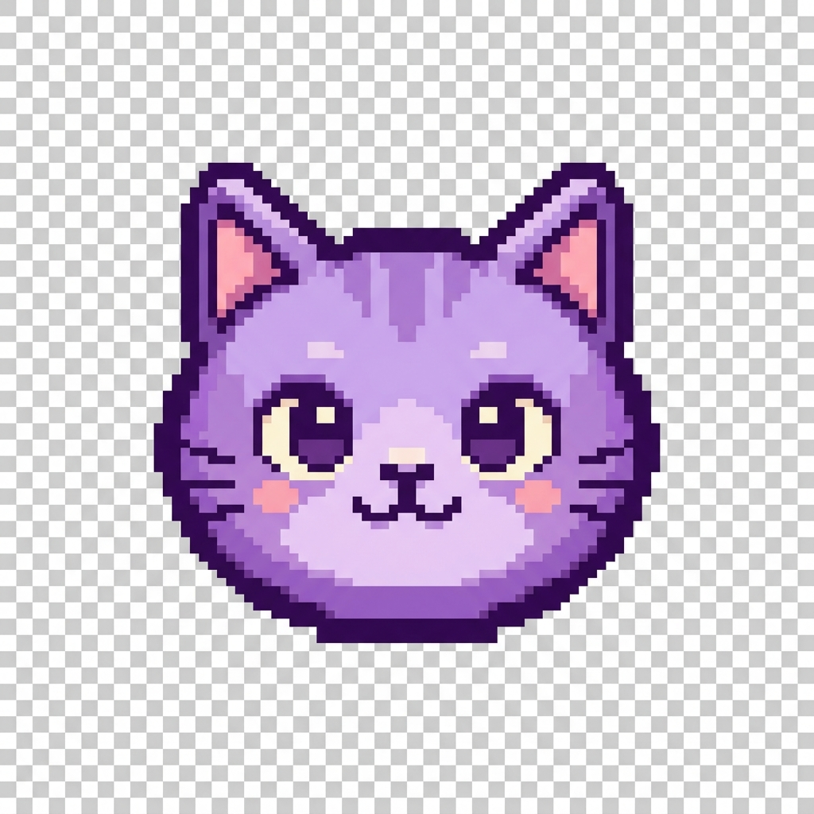
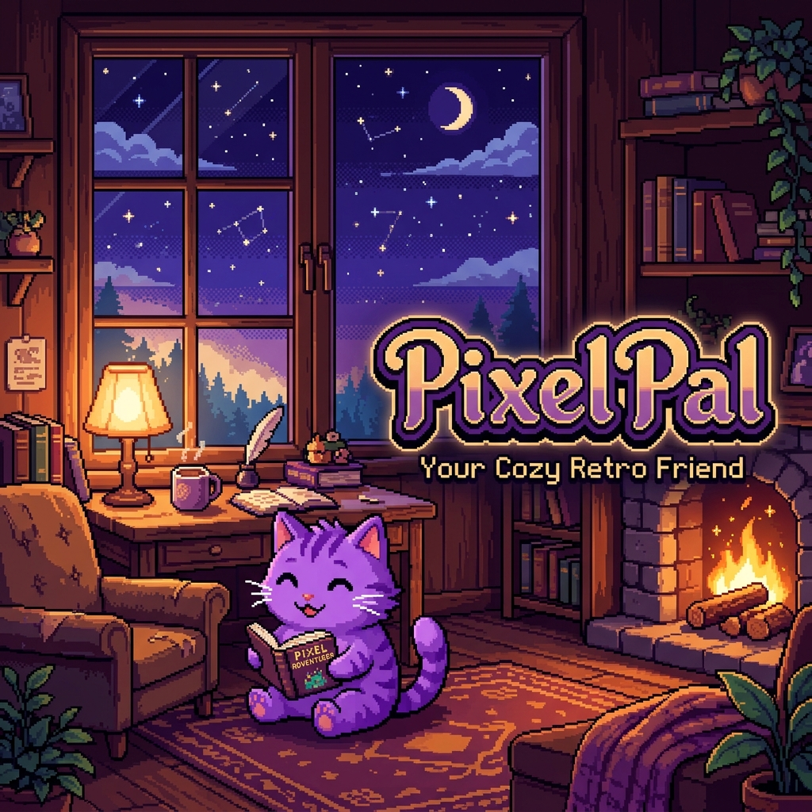
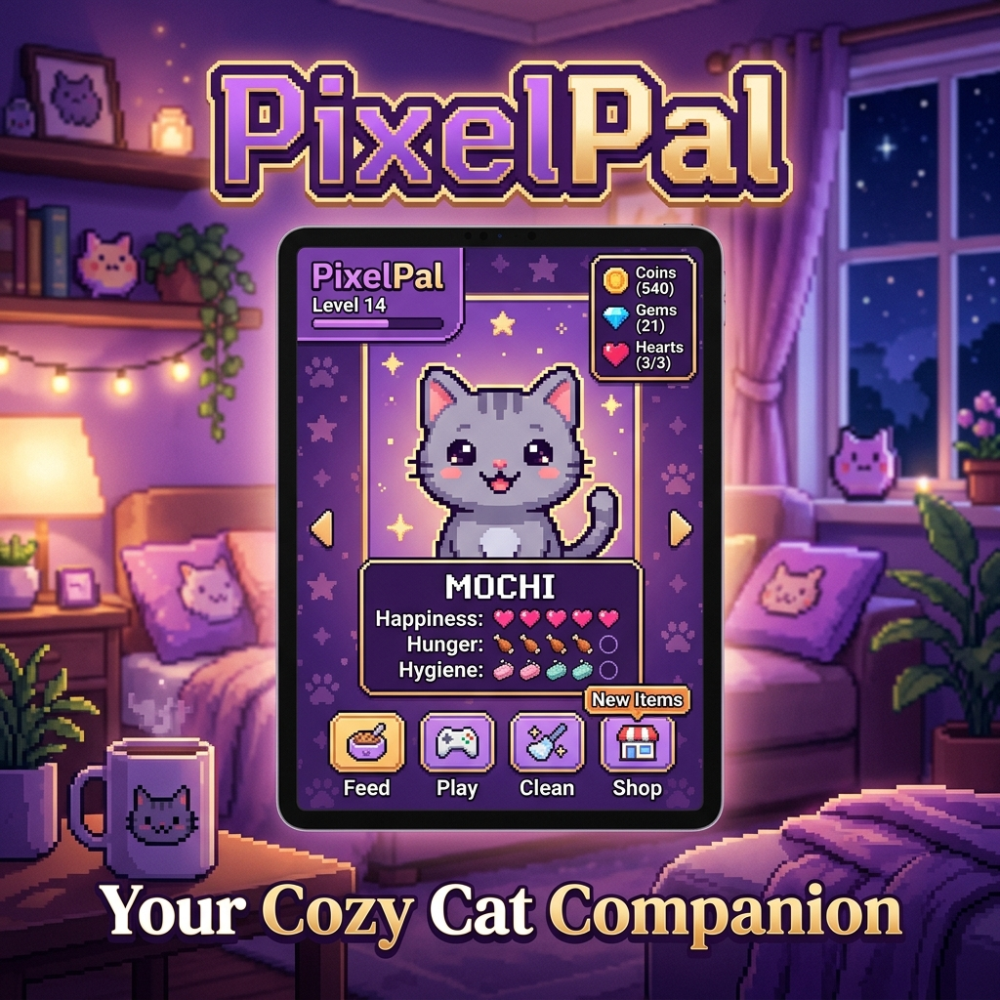

# Hero Section

<p align="center">
  
</p>

<h1 align="center">PixelPal</h1>

<p align="center">
  <strong>A cozy, retro-modern virtual cat companion that lives inside your browser.</strong>
</p>

<p align="center">
  <a href="https://github.com/vyxoredits-svg/PixelPal/releases"></a>
  
  
  
  
  
</p>

<p align="center">
  <a href="./index.html"><strong>🎮 Play Now</strong></a> &nbsp;|&nbsp; <a href="https://github.com/vyxoredits-svg/PixelPal"><strong>🐙 View GitHub</strong></a>
</p>

<p align="center">
  
</p>

# Screenshots

<p align="center">
  
</p>

# Features

<table align="center" style="width: 100%;">
  <tr>
    <td width="50%">
      <h3>🎨 8-Bit Canvas Engine</h3>
      <p>Programmatic 32x32 pixel animation renderer rendering cat components, twitching ears, wagging tails, sleeping curl, and level updates.</p>
    </td>
    <td width="50%">
      <h3>🔌 Progressive Web App (PWA)</h3>
      <p>Installable on Android and Desktop. Full offline cache mapping via service worker (sw.js) for uninterrupted play anywhere.</p>
    </td>
  </tr>
  <tr>
    <td width="50%">
      <h3>🪙 Shop & Wearables</h3>
      <p>Earn coins to purchase food, permanent toys, passive room furniture upgrades, and equipped hats in the Closet.</p>
    </td>
    <td width="50%">
      <h3>🎮 Mini-Games & Quests</h3>
      <p>Daily and weekly quest boards, plus 3 custom built minigames: Catch The Fish, Chase The Yarn, and Memory Match.</p>
    </td>
  </tr>
</table>

# Why PixelPal

PixelPal combines the nostalgic charm of 90s Tamagotchi virtual pets with a sleek, modern glassmorphism UI, a rich economic progression loop, and resilient offline play. It is built entirely on vanilla web technologies with no external runtime dependencies.

# Gameplay Systems

### Pet Care
Feed, pet, play, and let Pixel sleep. Stats dynamically decay over time. Pixel transitions between Happy, Hungry, Sleepy, Sleeping, and Idle states.

### Coins & Economy
Earn coins by performing actions, completing quests, and playing games. Spend them in the Pet Shop.

### Pet Shop
Buy food items (Fish, Premium Fish, Tuna Can, Fresh Salmon), active toys, room upgrades, and wearable cosmetics.

### Inventory System
Buy consumable treats, persist active toys, and equip accessories or furniture to apply passive experience and energy bonuses.

### Achievements
Unlock achievements like "First Meal", "Best Friend", and "Night Owl" to earn coins and unique notifications.

### Quests
Keep progression rewarding with fresh daily and weekly quest loops rewarding coins, XP, and exclusive cosmetics.

### Mini Games
Test timing, coordination, and memory in 3 mini-games:
- **Catch the Fish**: High-speed timing bar challenge.
- **Chase the Yarn**: Fast reflex cursor/tap game.
- **Memory Match**: Brain pattern visual matching grid.

### Friendship & Levels
Earn XP with Pixel to level up, increasing Pixel's physical scale. Build friendship ranks to unlock special dialog and badges.

### Prestige
Rebirth Pixel once they reach Level 30. Resets level to 1 in exchange for permanent +20% Coin/XP multipliers, unique titles, and the legendary Golden Crown.

### PWA Support
Full manifest specs, mobile status overrides, and offline asset caching via Service Workers.

# Installation

Open PixelPal by running it through a local web server (to support ES modules and Service Workers):

```bash
# Using Node/npm
npx -y serve .

# Or using Python
python -m http.server 8000
```

Open `http://localhost:3000` (or `http://localhost:8000` for Python) in your browser.

# Play Online

No setup required. Host PixelPal on any static provider (GitHub Pages, Vercel, Netlify) to play instantly!

# PWA Installation Guide

1. Navigate to the hosted URL or `localhost` on Chrome/Edge or Android.
2. Click the **Install Icon** in the address bar, or select **Add to Home Screen** in your mobile browser.
3. PixelPal now behaves as a standalone desktop/mobile application, launchable offline.

# Tech Stack

- **Core**: HTML5, Vanilla JavaScript (ES6 Modules)
- **Styling**: Vanilla CSS3 (Custom properties, blur filters, responsive grid)
- **Graphics**: HTML5 Canvas API (Programmatic 32x32 grid renderer)
- **Audio**: Web Audio API (Programmatic custom 8-bit synthesizer engine)
- **Storage & PWA**: Service Workers (offline caching), Web App Manifest, LocalStorage

# Project Structure

```text
PixelPal/
├── assets/
│   └── github/              # Premium branding logo, banner, and social previews
├── audio.js                 # 8-bit synthesizer tones and SoundManager singleton
├── game.js                  # Primary PixelPal controller and game loops
├── index.html               # Main structural workspace markup and PWA hooks
├── inventory.js             # Inventory container layout and consumption
├── LICENSE                  # MIT License template
├── manifest.json            # PWA standalone application description
├── minigames.js             # Mini-games mechanics and canvas frames
├── pet.js                   # COLOR palettes and PixelCatRenderer programmatic canvas
├── quests.js                # Daily and weekly quest boards
├── save.js                  # LocalStorage saves validation and export/import
├── shop.js                  # Shop item database and card layouts
├── style.css                # Custom properties, glassmorphism design tokens
├── sw.js                    # Service Worker caching assets for offline play
└── ui.js                    # Interaction listener hooks and tutorial overlays
```

# Save System

PixelPal incorporates a hardened save engine:
- **Offline Simulation**: Simulates missing time on startup, decaying stats and restoring sleep energy accurately.
- **Validation & Repair**: Validates and heals damaged states automatically against bounds checks.
- **Export & Import**: Download `.json` progress backups or import them to restore game states instantly.

# Performance Optimizations

- **30 FPS Throttle**: Throttles the canvas redraw loop to 30 FPS via requestAnimationFrame calculations to reduce CPU and battery consumption.
- **DOM Selector Caching**: Caches DOM element references in the class constructor, minimizing browser reflow and styling computation overhead.
- **Pure CSS Transitions**: Utilizes GPU-accelerated CSS properties for micro-animations and modal displays.

# Development Journey

1. **V1.0 - Core Prototype**: Implemented basic virtual pet states, statistics, and simple LocalStorage persistence.
2. **V1.1 - UI Glassmorphism**: Polished visual layouts, added interactive onboarding steps, and an embedded developer dashboard.
3. **V2.0 - Rich Visuals & Shop**: Created the programmatic animation engine, full item economy, shop, achievements, and quest logs.
4. **v2.1 - Modular Refactor**: Redesigned the monolithic code into cohesive JavaScript ES Modules.
5. **v2.2 - PWA Update**: Configured Manifest declarations, Service Worker asset caching, and custom app icons for offline support.

# Roadmap

- [ ] Sound volume slider memory persistence.
- [ ] Custom room customization skins.
- [ ] Cat customization patterns (tabby, stripes, calico).
- [ ] Push notifications for daily quest rewards.

# Changelog

See the detailed releases in [CHANGELOG.md](file:///c:/Users/vyxor/Downloads/PixelPal/CHANGELOG.md).

# Credits

Designed and developed by the PixelPal open-source community. Programmatic sound tones synthesized via HTML5 Web Audio API.

# License

PixelPal is open-source software licensed under the [MIT License](file:///c:/Users/vyxor/Downloads/PixelPal/LICENSE).
